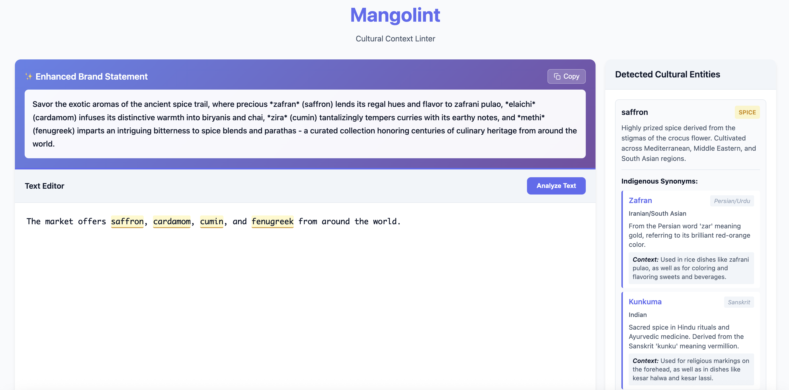

# Mangolint 🥭

A cultural linguistics linter powered by AI that identifies natural ingredients in text and provides indigenous synonyms with rich cultural context. Built with Amazon Bedrock's Claude 3 Sonnet and Flask.



## ✨ Features

### Core Capabilities
- **Real-time Cultural Analysis** - Identifies natural ingredients (fruits, herbs, spices, plants, minerals) as you type
- **Indigenous Synonyms** - Provides traditional terms from diverse global cultures with language attribution
- **Enhanced Brand Statements** - AI-generated product descriptions that integrate indigenous terms naturally
- **Cultural Context** - Ripeness stages, preparation methods, seasonal variations, and traditional uses
- **Brand Insights** - Authentic marketing opportunities and storytelling potential
- **Interactive UI** - Click highlighted terms to explore details, copy enhanced descriptions

### AI-Powered Analysis
The system uses an **Indigenous Linguist and Brand Anthropologist** AI persona with expertise in:
- Traditional ecological knowledge across global indigenous cultures
- Ethnobotany and cultural food systems
- Linguistic anthropology and semantic evolution
- Brand storytelling through cultural authenticity

## 🏗️ Architecture


### Technology Stack
- **Frontend**: HTML5, CSS3, Vanilla JavaScript
- **Backend**: Python 3.10+, Flask
- **AI/ML**: Amazon Bedrock (Claude 3 Sonnet)
- **Infrastructure**: AWS IAM, boto3 SDK
- **Deployment**: Heroku, AWS Elastic Beanstalk, Docker-ready

### Key Components
1. **Flask Web Application** - Serves UI and handles API requests
2. **Linter Module** - Interfaces with AWS Bedrock via boto3
3. **Caching Layer** - In-memory cache for improved performance (100 entry limit)
4. **Brand Statement Generator** - Creates culturally rich product descriptions

## 🚀 Quick Start

### Prerequisites
- Python 3.10 or higher
- AWS Account with Bedrock access
- Claude 3 model access in Amazon Bedrock
- AWS credentials configured in `~/.aws/credentials`

### Installation

1. **Clone the repository**
```bash
git clone https://github.com/jeffy893/mangolint.git
cd mangolint
```

2. **Run the setup script**
```bash
./setup.sh
```

3. **Configure environment**
```bash
cp .env.example .env
```

Edit `.env` and set:
```env
# Set to false to use real AWS Bedrock
USE_MOCK_LINTER=false

# AWS will use credentials from ~/.aws/credentials by default
# Optionally specify a profile:
# AWS_PROFILE=your-profile-name

BEDROCK_REGION=us-east-1
SECRET_KEY=your-secret-key-here
```

4. **Run the application**
```bash
source venv/bin/activate
python3.10 app.py
```

5. **Open your browser**
```
http://localhost:5001
```

## 💡 Usage

### Basic Workflow
1. Type or paste text into the editor (e.g., "Our pizza uses fresh mushrooms, peppers, and onions")
2. Wait 1.5 seconds for automatic analysis (or click "Analyze Text")
3. View highlighted ingredients with cultural insights in the sidebar
4. See the AI-generated enhanced brand statement above the editor
5. Click "Copy" to use the enhanced description

### Example Transformation

**Original Text:**
```
I have a pizza that uses mushrooms, peppers, and onions
```

**Enhanced Brand Statement:**
```
Celebrating traditional heritage: I have a pizza that uses hongos (mushrooms), 
chiles (peppers), and cebollas (onions) - a harmonious blend of earth's bounty 
crafted with cultural reverence.
```

### API Endpoints

#### `POST /analyze`
Full analysis triggered by "Analyze Text" button
```json
{
  "text": "Our product uses mango and turmeric"
}
```

#### `POST /lint`
Real-time linting (debounced, optimized for typing)
```json
{
  "text": "mango"
}
```

#### `POST /generate-brand-statement`
Generate enhanced product description
```json
{
  "text": "Original description",
  "entities": [...]
}
```

#### `GET /model-info`
Get current model configuration

#### `GET /health`
Health check endpoint

## 📊 Example Output

**Input:** "mango"

**Response:**
```json
{
  "text": "mango",
  "type": "cultural",
  "category": "fruit",
  "description": "Tropical stone fruit with deep cultural significance across South Asia, Latin America, and Africa.",
  "indigenous_synonyms": [
    {
      "term": "Manga",
      "language": "Portuguese",
      "culture": "Brazilian/Portuguese",
      "definition": "Derived from Malayalam 'māṅṅa'. Used in Brazilian cuisine for both ripe and green preparations.",
      "context": "Ripeness matters: 'manga verde' (green mango) for pickles, 'manga madura' (ripe mango) for desserts"
    },
    {
      "term": "Aam",
      "language": "Hindi/Urdu",
      "culture": "North Indian/Pakistani",
      "definition": "Sacred fruit in Hindu tradition. Over 1000 varieties cultivated.",
      "context": "Ripeness stages: 'kairi' (raw/green), 'aam' (ripe). Raw used for 'aam panna', ripe for 'aam ras'"
    }
  ],
  "brand_insights": "Authenticity opportunity: Specify ripeness stage and cultural preparation method.",
  "traditional_uses": "Culinary (fresh, dried, pickled), medicinal (digestive aid), ceremonial (leaves in rituals)",
  "authenticity_markers": [
    "Specify variety (Alphonso, Ataulfo, Tommy Atkins)",
    "Indicate ripeness stage",
    "Reference traditional preparation methods"
  ]
}
```

## ⚙️ Configuration

### AWS Credentials
The application uses boto3 which automatically reads credentials from:
1. `~/.aws/credentials` (recommended)
2. Environment variables (`AWS_ACCESS_KEY_ID`, `AWS_SECRET_ACCESS_KEY`)
3. IAM roles (when deployed on AWS)

### AWS Profile Support
To use a specific AWS profile:
```env
AWS_PROFILE=my-profile-name
```

### Mock Mode
For testing without AWS credentials:
```env
USE_MOCK_LINTER=true
```

## 🎨 Performance Optimizations

- **Debounced Input** - 1.5s delay prevents excessive API calls
- **Request Caching** - Identical text returns instantly from cache
- **Duplicate Prevention** - Blocks concurrent requests for same text
- **Preserved Highlights** - Reduces flickering during typing
- **Visual Feedback** - Shows analysis status in real-time

## 📁 Project Structure

```
mangolint/
├── app.py                      # Flask application with caching
├── linter.py                   # BedrockLinter class
├── linter_mock.py              # Mock linter for demo mode
├── architecture-diagram.py     # Architecture diagram generator
├── requirements.txt            # Python dependencies
├── setup.sh                    # Setup script
├── .env.example                # Environment template
├── static/
│   ├── css/
│   │   └── style.css          # Styles with brand statement section
│   └── js/
│       ├── app.js             # Main frontend logic
│       └── main.js            # Legacy support
├── templates/
│   └── index.html             # Main interface
├── docs/
│   └── archive/               # Historical documentation
│       ├── DEMO_MODE.md
│       ├── DEPLOYMENT.md
│       ├── MODES.md
│       ├── QUICK_START.md
│       ├── STATUS.md
│       └── TESTING.md
└── tests/
    ├── test_app.py
    └── test_linter.py
```

## 🧪 Testing

Run the test suite:
```bash
source venv/bin/activate
python3.10 run_tests.py
```

See [docs/archive/TESTING.md](docs/archive/TESTING.md) for detailed testing guide.

## 🚢 Deployment

### Heroku
```bash
heroku create your-app-name
heroku config:set USE_MOCK_LINTER=false
heroku config:set AWS_ACCESS_KEY_ID=your_key
heroku config:set AWS_SECRET_ACCESS_KEY=your_secret
heroku config:set BEDROCK_REGION=us-east-1
git push heroku main
```

### AWS Elastic Beanstalk
```bash
eb init -p python-3.10 mangolint
eb create mangolint-env
eb setenv USE_MOCK_LINTER=false BEDROCK_REGION=us-east-1
eb deploy
```

See [docs/archive/DEPLOYMENT.md](docs/archive/DEPLOYMENT.md) for comprehensive deployment guide.

## 📚 Documentation

- [Demo Mode Guide](docs/archive/DEMO_MODE.md) - Running without AWS credentials
- [Deployment Guide](docs/archive/DEPLOYMENT.md) - Production deployment instructions
- [Testing Guide](docs/archive/TESTING.md) - Comprehensive testing documentation
- [Quick Start](docs/archive/QUICK_START.md) - Fast setup guide
- [Modes](docs/archive/MODES.md) - Mock vs Real Bedrock modes

## 🤝 Contributing

Contributions are welcome! Please feel free to submit a Pull Request.

## 📄 License

MIT License - see LICENSE file for details

## 🙏 Acknowledgments

- Built with [Amazon Bedrock](https://aws.amazon.com/bedrock/) and Claude 3 Sonnet
- Inspired by the need for culturally authentic brand storytelling
- Thanks to indigenous communities for preserving traditional knowledge

## 📧 Contact

For questions or feedback, please open an issue on GitHub.

---

**Made with ❤️ for cultural authenticity and brand storytelling**
