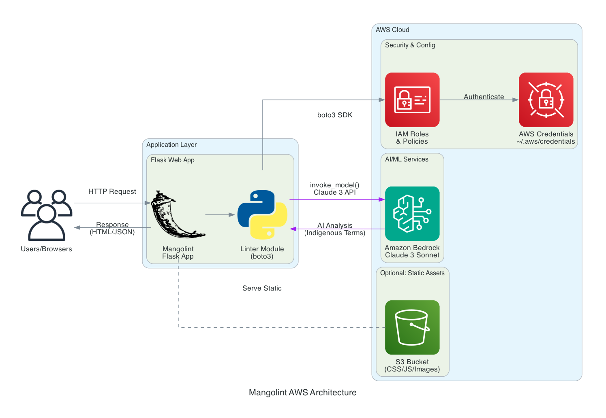

# 🥭 Mangolint
## Fighting Language Death Through Brand Authenticity

**AI-Powered Cultural Linguistics Linter**

---

## The Crisis

### 2019 - UN Year of Indigenous Languages

- **40% of 7,000 languages** are endangered
- **One language dies every 2 weeks**
- English homogenization erases cultural diversity

**Our Mission:** Slow language death by putting indigenous terms on product labels

---

## The Opportunity

### $2 Trillion CPG Market Needs This

**Brand Managers Want:**
- Cultural authenticity for premium pricing
- Connection with diverse consumers
- Avoid costly appropriation mistakes

**Current Solution:** $320-600 per ingredient (2-4 hours research)

**Mangolint:** $0.01 per analysis (5 seconds)

---

## Our Journey

### Team Collaboration & Learning

**What We Mastered:**
- Git & GitHub workflows from scratch
- Version control best practices
- Kiro AI for rapid development

**Result:** Production-ready tool built collaboratively in record time

---

## How It Works



**Amazon Bedrock Claude 3** acts as Indigenous Linguist & Brand Anthropologist

---

## Live Demo

### Input:
```
Our pizza uses mushrooms, peppers, and onions
```

### Output:
```
Our pizza uses hongos (mushrooms), chiles (peppers), 
and cebollas (onions) - celebrating traditional heritage
```

**Plus:** Full cultural context, traditional uses, authenticity markers

---

## Key Features

- ✅ **Instant Analysis** - 5 seconds vs 2-4 hours
- ✅ **50+ Languages** - Indigenous terms from global cultures
- ✅ **Brand Statements** - AI-generated marketing copy
- ✅ **Interactive UI** - Hover tooltips, copy-paste ready
- ✅ **99% Cost Savings** - $0.01 vs $320-600

---

## Real Impact

### Every Product Label Matters

**When "turmeric" becomes "haldi" (Hindi):**
- Language stays alive in commerce
- Cultural knowledge preserved
- Children learn traditional terms
- Communities maintain identity

**Scale:** 1 CPG brand = millions of labels = massive language exposure

---

## Go-Forward: Browser Extension

### Phase 1 (Now): Web Application ✅
### Phase 2 (Next): Browser Extension

**Vision:** Linter dropdown like spell-check
1. Type "turmeric" in any text field
2. Mangolint underlines it
3. Dropdown shows: haldi, manjal, pasupu
4. Select term for your market

**Phase 3:** Product Integration - OCR & barcode scanning to generate culturally significant brand marketing from existing products

---

## Business Model

### Sustainable & Scalable

**Pricing:**
- Starter: $99/month (1,000 analyses)
- Professional: $499/month (10,000 analyses)
- Enterprise: Custom (unlimited + API)

**Target:** 100 brands = $50K MRR
**Infrastructure:** < $500/month
**Gross Margin:** 99%

---

## Call to Action

### Join Us in Fighting Language Death

**Next Steps:**
- Try the demo: http://localhost:5001
- Pilot program for CPG brands
- Investment opportunities

**Together we can save languages while building profitable brands**

---

# Thank You! 🙏

## Mangolint
**Where Commerce Meets Cultural Preservation**

GitHub: github.com/jeffy893/mangolint
MIT Licensed • Open Source • Production Ready
